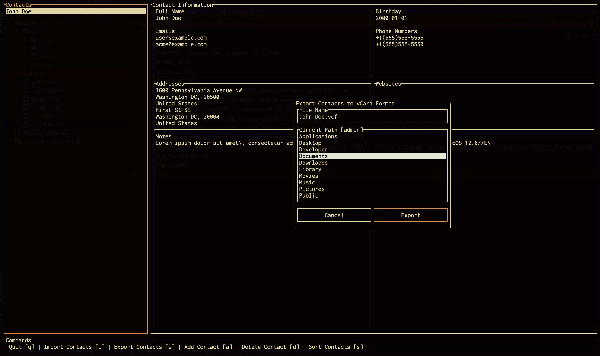

# vCard TUI

Terminal UI application for managing vCard contacts, written in Rust. It uses the vCard format for importing and exporting contact data.


[](https://crates.io/crates/vcard_tui)
[](https://github.com/kenianbei/vcard_tui/blob/main/LICENSE)
[](https://github.com/kenianbei/vcard_tui/tags)



## Install

Install via cargo.

```shell
cargo install vcard_tui
```

Install via homebrew.

```shell
brew tap kenianbei/vct
brew install vct
```

## Usage

```shell
vct
```
